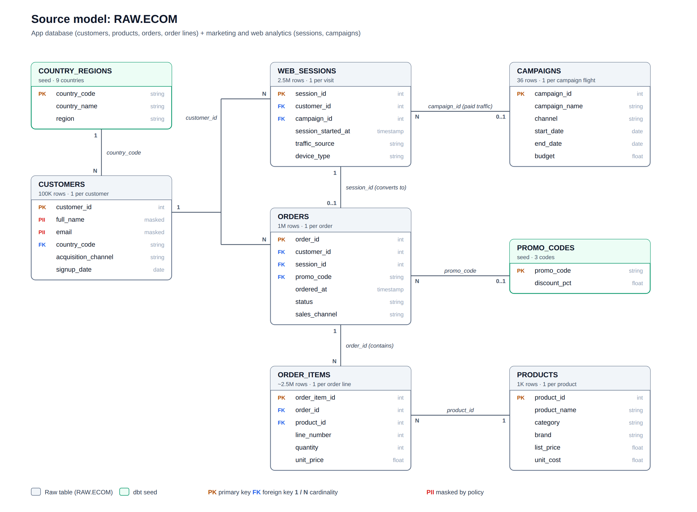

# AI-Ready Semantic Layer: one certified definition per metric, served everywhere

**Business problem:** When every team calculates revenue, AOV and ROAS its own way, dashboards disagree and leaders stop trusting the numbers.

**Solution:** Define each metric once in code, test and govern it, and serve the same certified numbers to every BI tool and AI agent.

**Stack:** Snowflake · dbt Core + MetricFlow · GitHub Actions CI/CD · Power BI (DAX) · LangGraph + Claude agent via MCP

> **Status: building in public, phase by phase.** The code for phases 0–10 is in this repo
> and was tested end to end locally. Each phase below is ticked once it runs on Snowflake,
> with screenshots added under `docs/images/`.

| # | Phase | Status |
|---|---|---|
| 0–2 | Snowflake foundation, dbt Core setup | ⬜ |
| 3–5 | Staging → marts, contracts, tests, MetricFlow semantic layer, SCD2 snapshot | ⬜ |
| 6–8 | Governance (masking, row access, catalog), metric exports, CI/CD with slim CI | ⬜ |
| 9–10 | Power BI: certified KPIs, DAX dashboard, drill-through, RLS, incremental refresh | ⬜ |
| 11–12 | Power BI as code (PBIP/TMDL), agent-built measures via Power BI Modeling MCP | ⬜ |
| 13–14 | dbt → Snowflake semantic view (Apache Ossie), conversational analytics via Snowflake MCP | ⬜ |
| 15–16 | LangGraph + Claude Metrics Analyst Agent, AI accuracy eval | ⬜ |

## Data sources

The data imitates a real online store that sells about 1,000 products through a website and a mobile app, to customers in 9 countries, with 3 years of history. It comes from two places, just like at a real company:

- **The store's app database:** customers, products, orders, and the order lines (one line per product in an order)
- **Marketing and web analytics:** website and app visits (sessions), and the paid campaigns that drove them

| Table (`RAW.ECOM`) | Rows | One row per |
|---|---|---|
| customers | 100,000 | customer |
| products | 1,000 | product |
| campaigns | 36 | campaign (3 channels × 12 quarters) |
| web_sessions | 2,500,000 | website or app visit |
| orders | 1,000,000 | order |
| order_items | ~2,500,000 | product line inside an order |

Two small reference files (dbt seeds) map each country to its region and each promo code to its discount.

The data is synthetic, generated inside Snowflake with SQL (`snowflake/02_generate_data.sql`), and tuned to behave like real data: signups grow over time, email converts best, about 4% of orders are returned, and no visit happens before a customer signs up. Customer names and emails are personal data (🔒 PII), so a Snowflake policy masks them, and they never reach the reporting tables.

## Data modeling with dbt

Raw data isn't ready for reporting. Orders have no money columns, customers have no region, and nothing says which orders count as revenue. dbt turns it into clean, tested tables in four steps:

1. **Staging: clean the raw data.** One view per source table that renames columns, fixes data types and tags personal data. Nothing is joined yet.
2. **Intermediate: prepare the tricky logic.** Works out which segment each customer was in on any given date: prospect (0 orders), one-time (1), repeat (2–14) or loyal (15+).
3. **Snapshot: keep history.** Records every time a customer changes segment (SCD Type 2), so we can ask "which segment was this customer in when they ordered?"
4. **Marts: build the star schema.** The final tables that dashboards, the semantic layer and the AI agent read.

The marts follow a **star schema**:

- **Facts** (the centre) record what happened, with the numbers:
  - `fct_web_sessions`: one row per visit
  - `fct_orders`: one row per order, with revenue, discount, cost and profit calculated once
  - `fct_order_items`: one row per product in an order
- **Dimensions** (around them) describe who, what, where and when: customers, customer segment history, products, campaigns, dates and regions.

**Business rules are decided once, here, and every report inherits them:**

- Only **completed or shipped** orders count as revenue (`is_recognized`)
- Each order is credited to the campaign behind the visit that led to it (last touch)
- Personal data never reaches the marts

**Tests guard every table:** contracts lock each core table's columns and types, unit tests check the business logic, and data tests check keys, ranges and totals. For example, one test proves the order lines add up exactly to the order totals.

On top of these marts, the **MetricFlow semantic layer** defines every metric once (revenue, AOV, ROAS and 30 more). Each mart's join keys are declared, so MetricFlow joins tables safely by itself, and `net_revenue` is defined once and reused by every ratio and growth metric, so the revenue rule can't drift.

## What makes the numbers trustworthy

- **Defined once:** every metric lives in dbt YAML with an owner, grain, refresh SLA and business definition, and is computed by MetricFlow outside Snowflake.
- **Locked structure:** core tables have enforced contracts, so a breaking column change fails CI before it reaches a dashboard.
- **Tested logic:** unit tests and business-rule tests guard the calculations, and slim CI on Snowflake rebuilds only what a pull request changed.
- **Protected data:** PII is masked at the source, and row access policies limit each regional analyst to their own region.
- **Reconciled reporting:** Power BI shows the certified metrics plus a DAX dashboard checked against them, and every page traces back to the raw data.
